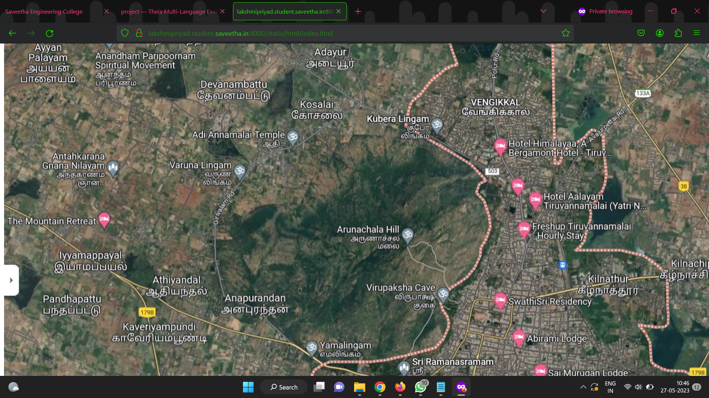

# Places Around Me
## AIM:
To develop a website to display details about the places around my house.

## Design Steps:

### Step 1:
Create a new django project and app
### Step 2:
Add a new imagemap html file in templates and neede images in static folder and define it in settings.
### Step 3:
Type ur image map code in the html with coordinates and target file to redirect on click
### Step 4:
Define your components pages and create content in such a way that it gives information about place which is being clicked
### Step 5:
Include pictures and contents for your subpages and map them using urls and views
## Code:
```

<!DOCTYPE html>
<html lang="en">
    <head>

    </head>
    <body>
        
<map name="image-maps-2023-04-20-084957" id="ImageMapsCom-image-maps-2023-04-20-084957">
<area  alt="" title="Arunachala Hill" href="hill.html" shape="rect" coords="642,370,798,430" style="outline:none;" target="_self"    data-maphilight='aurachala hill' />
<area  alt="" title="cave" href="cave.html" shape="rect" coords="689,489,885,565" style="outline:none;" target="_self"    data-maphilight='cave' />
<area  alt="" title="college" href="college.html" shape="rect" coords="910,725,1046,836" style="outline:none;" target="_self"    data-maphilight='college

' />
<area  alt="" title="hotel" href="hotel.html" shape="rect" coords="982,305,1214,371" style="outline:none;" target="_self"    data-maphilight='hotel' />
<area  alt="" title="school" href="school.html" shape="rect" coords="230,714,470,813" style="outline:none;" target="_self"    data-maphilight='school' />
<area shape="rect" coords="1918,972,1920,974" alt="Image Map" style="outline:none;" title="Image Map" href="https://www.image-maps.com/" />
</map>

    </body>
</html>


```

## Output:


## Result:
Thus a website is developed to display details about my school near my house.
